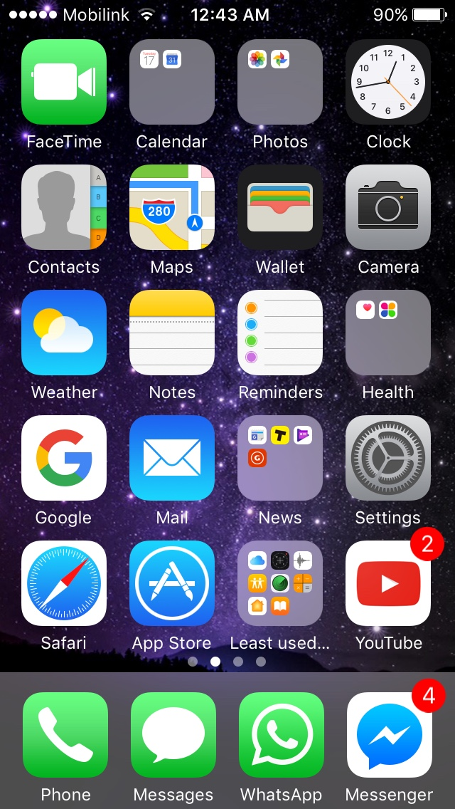

# Tijd voordat het scherm uitgaat aanpassen
Je kunt op je iPhone, iPad of iPod Touch de tijd aanpassen voordat het scherm uitgaat.

Vaak staan fabrieksinstellingen vrij snel ingesteld om de batterij te sparen. Echter, dit kan best wel vervelend zijn, en als je zelf je mobiel uitzet als je hem niet gebruikt maakt het in batterijgebruik niets uit.

Je kunt de stappen hieronder uitvoeren om de tijd voordat je scherm uitgaat aan te passen. Let op de iOS versie die je hebt; kies diegene waar de foto's het meest lijken op die van jou mobiel of tablet. Maar als het werkt, dan werkt het ;)

## iOS 14+
1. Ga naar instellingen
    1. Het makkelijkste kun je eerst naar je home-scherm gaan.
       

       

       Foto
       

       
       

    2. Dan [swipe je naar rechts](../../skills/swipen.md#naar-rechts-swipen) totdat je bij het overzicht van alle applicaties uitkomt.
       

       

       Foto
       

       
       

    3. Klik op de zoekbalk bovenin en zoek op: `instellingen`.
       

       

       Foto
       

       
       

    4. Klik op instellingen.

2. [Swipe naar beneden](../../skills/swipen.md#naar-beneden-swipen) totdat je `Beeldscherm & Helderheid` ziet; klik daarop.
    

    

    Foto
    

    
    

3. [Swipe weer naar beneden](../../skills/swipen.md#naar-beneden-swipen) totdat je `Automatisch vergrendelen` ziet; dit is de instelling die we moeten hebben.
    

    

    Foto
    

    
    

4. Als je daarop klikt, kun je kiezen hoe lang het duurt voordat je telefoon automatisch uit gaat.
    

    

    Foto
    

    
    

5. Je telefoon zou nu eerder of later uit moeten gaan!
