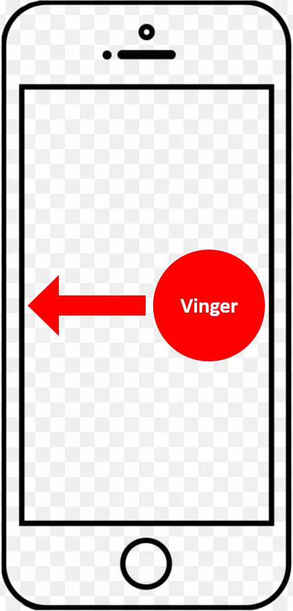
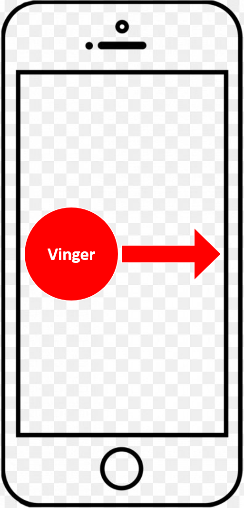
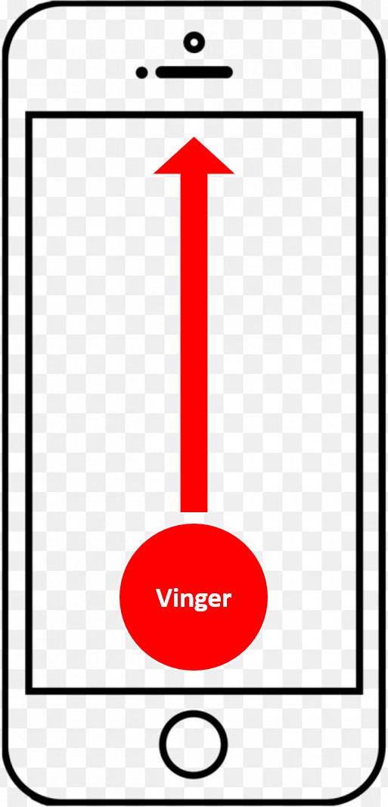
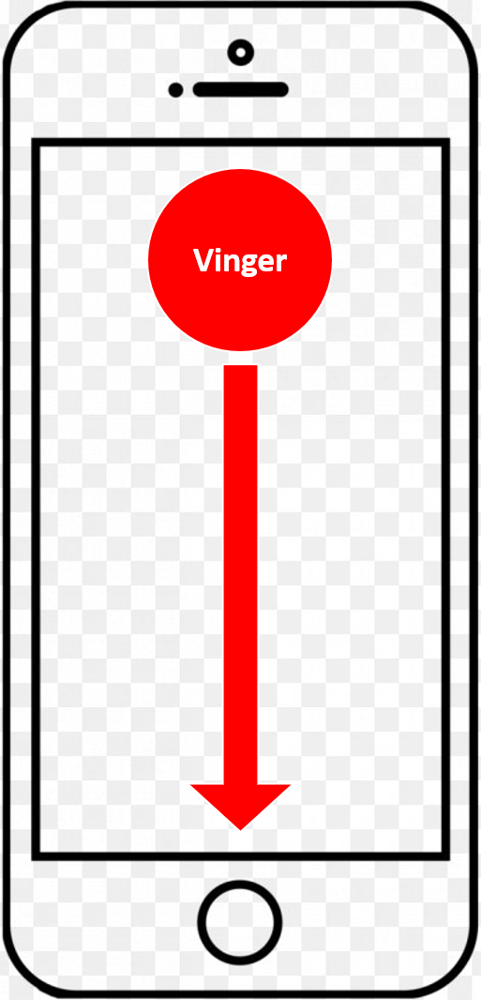

# Swipen
Op deze pagina kun je vinden wat ik precies bedoel met _swipen_, en dan vooral welke variatie. Je kunt ze hieronder vinden.

## Simpele swipes
De _simpele swipes_ zijn de makkelijkste swipes die je vaak gebruikt, deze ken je wel. Om verwarring te voorkomen welke richting ik bedoel, heb ik het steeds over de richting die je vinger opgaat, niet wat op je scherm gebeurt.

> Let erop dat je niet met je vinger naast het scherm begint; dit is _van binnen naar buiten swipen_ (zie  [hieronder](#van-binnen-naar-buiten-swipes)).

### Naar links swipen
Om naar links te swipen, plaats je je vinger aan de rechterkant van het scherm en beweeg je deze naar links.

Foto

### Naar rechts swipen
Om naar rechts te swipen, plaats je je vinger aan de linkerkant van het scherm en beweeg je deze naar rechts.

Foto

### Naar boven swipen
Om naar boven te swipen, plaats je je vinger aan de onderkant van het scherm en beweeg je deze naar boven.

Foto

### Naar beneden swipen
Om naar beneden te swipen, plaats je je vinger aan de bovenkant van het scherm en beweeg je deze naar beneden.

Foto

## Van-binnen-naar-buiten swipes
